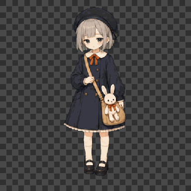
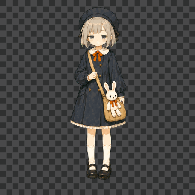

# Little Chihiro Pet · Godot Native

A tiny companion that lives on your Windows desktop. AI-generated artwork, a
native Godot runtime — no Electron, no WebView, no Node.js, no Rust.

一只住在 Windows 桌面上的小桌宠。AI 逐帧作画，Godot 原生运行时，不依赖
Electron / WebView / Node.js / Rust。


---

## Demo / 演示




> Animation previews rendered from approved frames. 动画预览取自验收帧。

---

## What is this / 这是什么

**EN** — She is not a static sticker. She idles, roams and climbs around the
edges of your desktop, looks toward your cursor, perks up when petted, gets
annoyed when poked, yawns when sleepy, and floats down slowly with an umbrella
from a window edge. She carries five life stats — `energy / boredom /
curiosity / irritation / affection` — decides her next action on her own, and
talks to you with 140 offline Chinese speech-bubble lines.

**中文** — 她不是一张静态贴纸，而是会自己决定生活的小家伙：在桌面边角待机、
闲逛、攀爬，跟着光标张望，被摸头会开心，被戳脸会不耐烦，困了会打哈欠，也会
撑着伞从窗口边缓缓飘落。她带着 `energy / boredom / curiosity / irritation /
affection` 五项生命状态，自主决定下一步做什么，用 140 条离线中文气泡台词
和你对话。

---

## Features / 功能

**EN**

- Transparent, borderless, always-on-top desktop pet window with a native tray menu
- State machine: `boot / idle / float / edge_patrol / dragged / drag_fall / land`
- Interactions: click, head-pat, poke, drag, brake/reverse, free-fall, umbrella descent
- Gaze: nine-direction tracking, distance/angle hysteresis, glance reactions
- Climbing family: A/B wall climbs, ground/wall/balloon flight, root motion fallbacks
- Five life stats with five relationship tiers; low energy continuously favors timed sitting rest or sleep
- 140 offline Chinese speech-bubble lines with privacy filtering
- 9 CC0 sound effects with independent toggle
- F10 debug panel; an action browser over 16 daily-behavior families
- Position persistence, auto-roam and cursor-follow toggles

**中文**

- 透明、无边框、置顶的桌宠窗口 + 原生托盘菜单
- 状态机：`boot / idle / float / edge_patrol / dragged / drag_fall / land`
- 交互：点击、摸头、戳脸、拖拽、急停/反向、直坠、持伞缓降
- 九向注视、距离/角度迟滞、快速扫过与绕圈反应
- A/B 攀墙家族、地面/墙面/气球飞行、root motion 降级路线
- 五项生命状态与五档关系；精力越低越倾向按实际时长坐下休息或睡眠
- 140 条离线中文气泡台词与隐私过滤
- 9 个 CC0 音效，独立开关
- F10 调试面板；按 16 个生活行为族浏览全部动作的“动作总览”
- 位置持久化、自主闲逛与光标跟随开关

---

## Download / 下载

**EN** — The latest desktop-integration test build is `v0.21.0-beta.6`.
Download the Windows x86_64 ZIP or `LittleChihiroPet.exe` from the
[Releases](https://github.com/Chihiro521/project-chihiro/releases) page. The
window is transparent, borderless and always-on-top.

**中文** — 最新桌面生态测试版为 `v0.21.0-beta.6`。从
[Releases](https://github.com/Chihiro521/project-chihiro/releases) 页下载
Windows x86_64 ZIP 或 `LittleChihiroPet.exe` 即可。窗口透明、无边框、置顶。

> `v0.21.0-beta.6` is a prerelease for the active desktop-integration line.
> `v0.21.0-beta.6` 是当前桌面生态开发线的测试版本。

---

## Run from source / 从源码运行

**EN** — Requires Godot 4.7.1, export templates, and a built Win32 GDExtension
(see `native/windows/README.md`).

**中文** — 需要 Godot 4.7.1、export templates，以及编译好的 Win32 GDExtension
（见 `native/windows/README.md`）。

```powershell
& 'D:\godot\引擎版本\Godot_v4.7.1-stable_win64.exe\Godot_v4.7.1-stable_win64.exe' --path 'D:\workspace\project-chihiro'
```

Open the editor / 打开编辑器：

```powershell
& 'D:\godot\引擎版本\Godot_v4.7.1-stable_win64.exe\Godot_v4.7.1-stable_win64.exe' --editor --path 'D:\workspace\project-chihiro'
```

Export the Windows release / 导出 Windows 版：

```powershell
& 'D:\godot\引擎版本\Godot_v4.7.1-stable_win64.exe\Godot_v4.7.1-stable_win64_console.exe' --headless --path 'D:\workspace\project-chihiro' --export-release 'Windows Desktop'
```

Output goes to `build/LittleChihiroPet.exe` with the GDExtension DLL.
输出为 `build/LittleChihiroPet.exe` 与同目录的 GDExtension DLL。

---

## Test / 测试

```powershell
& 'D:\godot\引擎版本\Godot_v4.7.1-stable_win64.exe\Godot_v4.7.1-stable_win64_console.exe' --headless --path 'D:\workspace\project-chihiro' --log-file 'D:\workspace\project-chihiro\godot-tests.log' --script res://scripts/tests/run_tests.gd
```

Baseline: `PASS: 1167 assertions` with Godot 4.7.1.
基线：Godot 4.7.1 自动回归 `PASS: 1167 assertions`。

---

## Project structure / 目录结构

```text
project.godot
scenes/main.tscn
scripts/main.gd                 # runtime & interaction orchestration / 运行时与交互编排
scripts/core/                   # state machines, animation, gaze, drag, patrol
scripts/platform/               # Godot DisplayServer/Window platform layer
scripts/tests/run_tests.gd      # logic & asset contract tests
skins/little-chihiro/           # pet.json + transparent PNG frames
data/                           # behavior params, action catalog, speech lines
native/windows/                 # Win32 GDExtension + pinned godot-cpp submodule
art/animation-production/       # animation contracts, key poses, QA records
```

---

## Tech notes / 技术说明

- Native **Godot 4.7 / GDScript** runtime with a Win32 C++ GDExtension platform
  layer. No Tauri, Electron, WebView, Node.js or Rust.
- All animation frames are **AI-generated** (OpenAI imagegen), drawn frame by
  frame as complete images — no interpolation or tweening. Detailed production
  contracts and QA records live under `art/animation-production/`.

- **Godot 4.7 / GDScript** 原生运行时 + Win32 C++ GDExtension 平台层。无
  Tauri、Electron、WebView、Node.js、Rust。
- 所有动画帧均为 **AI 作图**（OpenAI imagegen）逐帧完整绘制，不使用补间插值。
  详细制作契约与 QA 记录见 `art/animation-production/`。

---

## License / 许可证

[MIT](LICENSE). Third-party notices: [THIRD_PARTY_NOTICES.md](THIRD_PARTY_NOTICES.md).
MIT 协议，见 [LICENSE](LICENSE)；第三方声明见 [THIRD_PARTY_NOTICES.md](THIRD_PARTY_NOTICES.md)。
